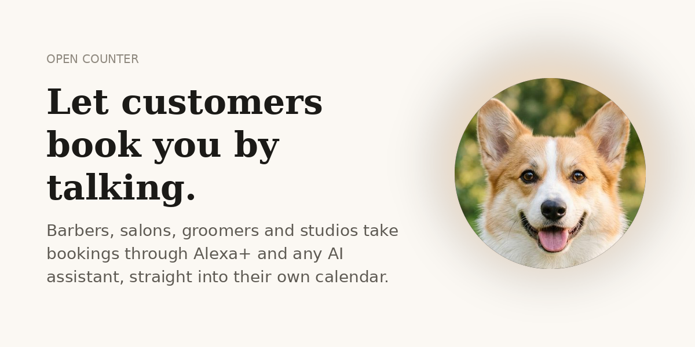
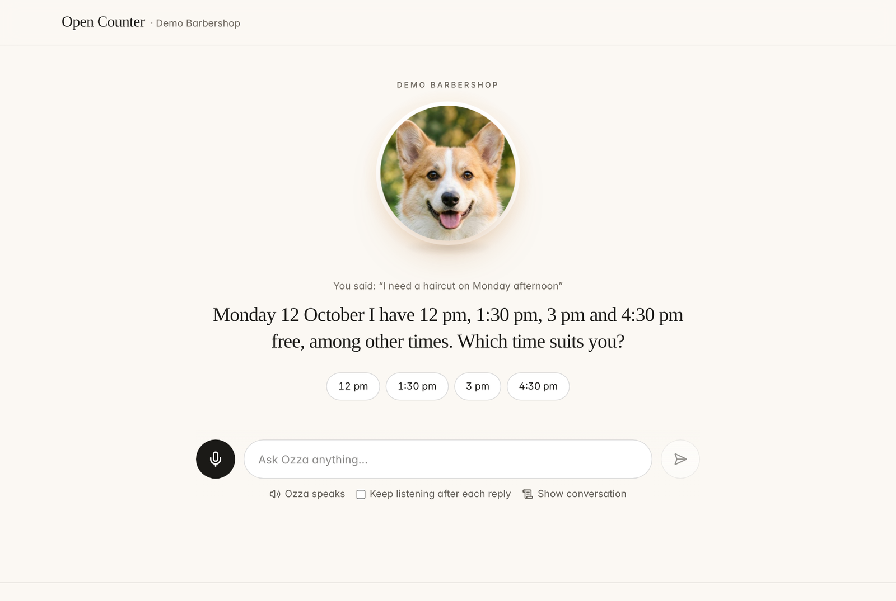
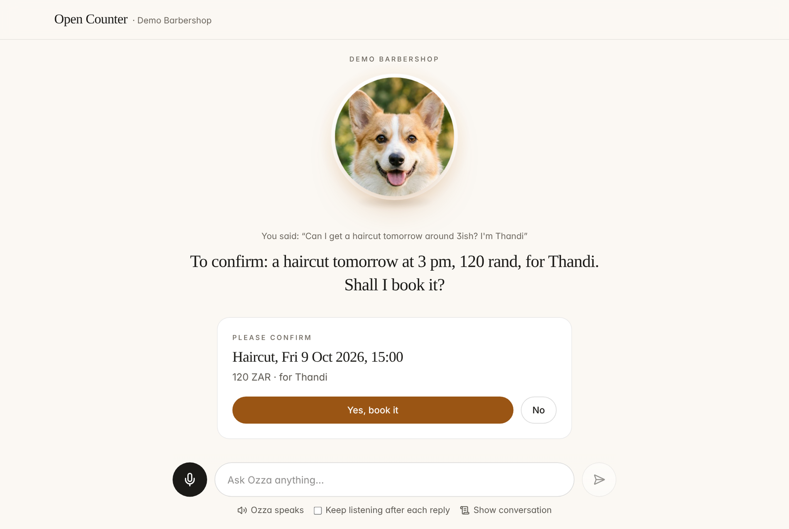
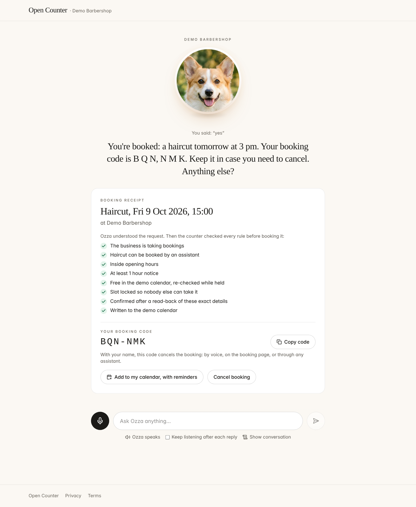
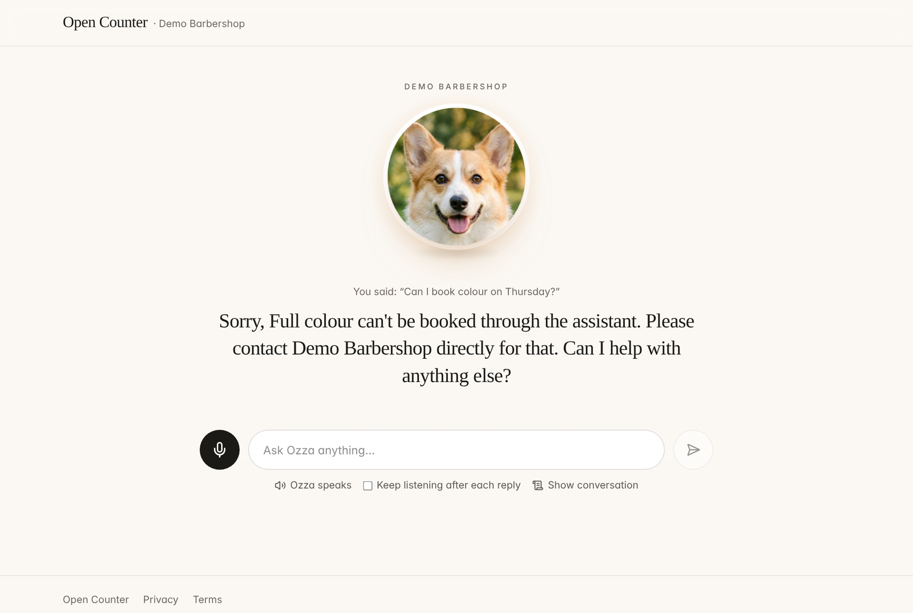
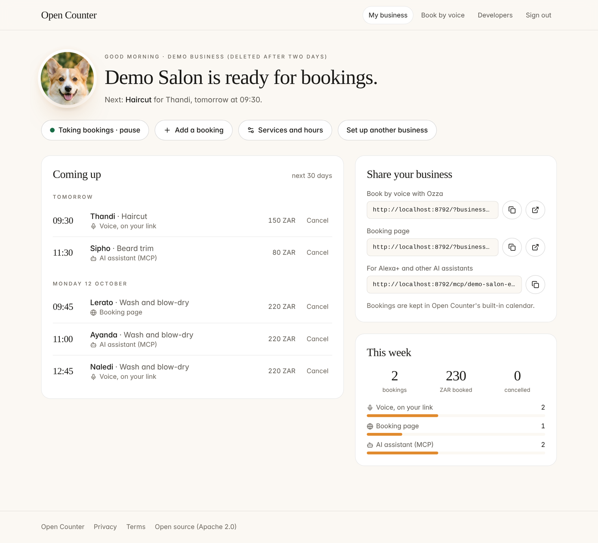
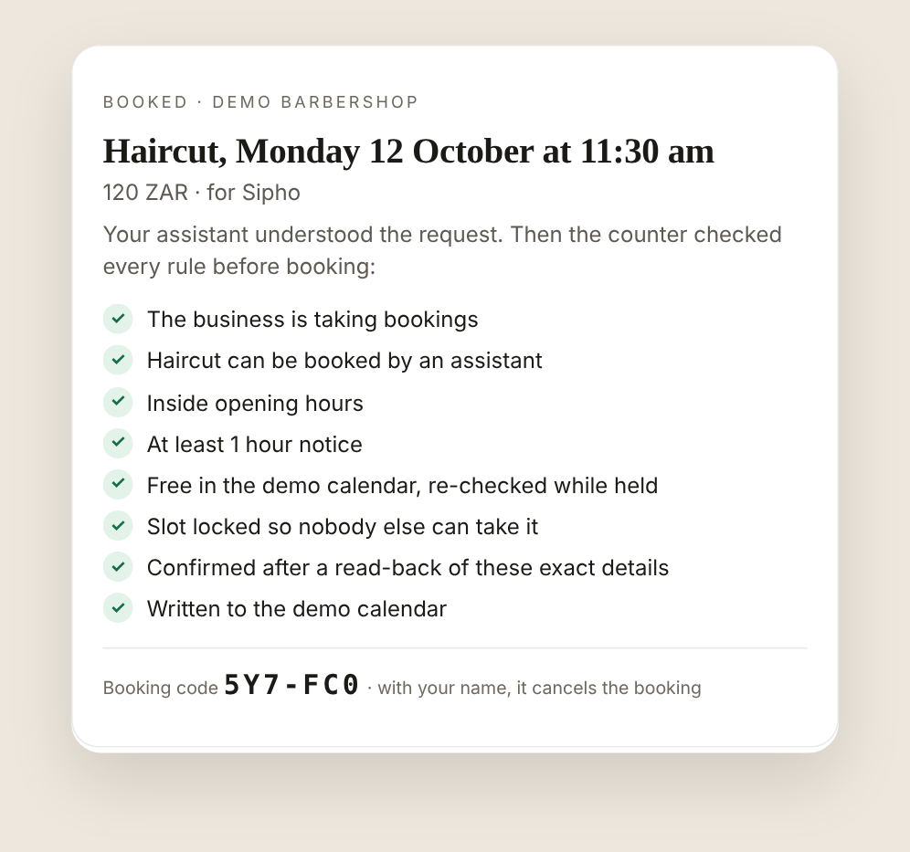
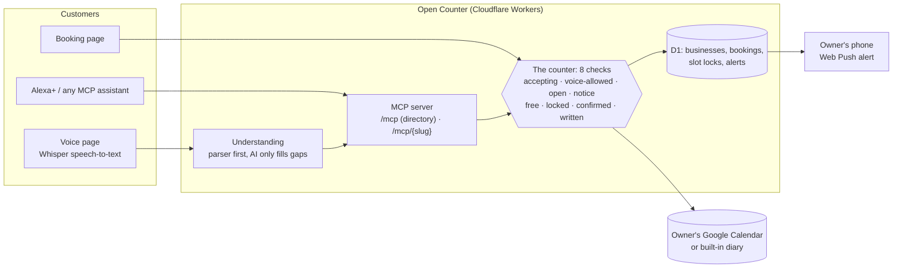

# Open Counter

**Let customers book a small business by talking.** An owner sets up their business in one spoken conversation and
connects Google Calendar with one click. From then on, customers can book them through Alexa+ or any AI assistant,
on a voice page, or on a booking page. The AI understands the customer; the server decides. Every rule is checked
before anything is booked, and the customer sees a receipt of each check.

**Live:** https://open-counter.opencounter.workers.dev &nbsp;·&nbsp; **Demo video:** _add link_ &nbsp;·&nbsp;
**Track:** Alexa+ (Amazon *Build, Ship, Shape* hackathon) &nbsp;·&nbsp; **Licence:** Apache 2.0

<p align="center"></p>

---

## The problem

A barber with clippers in hand can't answer the phone. A stylist halfway through a colour can't reply to messages.
Every missed call is a missed booking, and most independent businesses still take bookings that way. Booking
software exists, but it asks owners to fill in forms, and it doesn't work with the voice assistants customers already
talk to.

AI assistants can now take actions for people, but a booking is a promise. An assistant that invents a free slot,
books a service the owner only does after a consultation, or books without a clear "yes" costs the business money
and trust.

## What Open Counter does

| For the owner | For the customer | For any AI assistant |
|---|---|---|
| Describe the business to Ozza in plain words: services, prices, hours, and anything that must never be booked by voice. A live checklist fills in as you talk. | Ask for a haircut "Friday around 3ish". Ozza offers real free times, reads the booking back, and books only after a yes. | One MCP server for every listed business (`/mcp`), or one per business (`/mcp/{slug}`). |
| Connect Google Calendar with one click. Your own appointments block those times automatically. | Get a receipt of every rule the server checked, a six-character booking code (like `6J0-1RW`), and a calendar file with reminders. | Titled, annotated tools with output schemas and sentences written to be said aloud. |
| See bookings as they arrive, and where each came from (Alexa+/assistant, voice page, booking page, walk-in). Get a phone alert for each one. | Cancel later by voice or on the web with the code and your name. | An MCP Apps booking card for screens like Echo Show: tap a time, confirm, see the receipt. |

## See it working

Captured from the real app and the real MCP server (`npm run dev:local`, the same Worker code that is deployed).

| 1. Ozza offers real free times | 2. The read-back, before anything is booked | 3. The receipt: every check, and a booking code |
|---|---|---|
|  |  |  |

| 4. A rule says no, and the customer hears why | 5. The owner's dashboard: bookings and where they came from | 6. The MCP Apps card an assistant shows on a screen |
|---|---|---|
|  |  |  |

More: [home](docs/screenshots/01-home.png) · [developers page](docs/screenshots/07-developers.png) ·
[card: free times](docs/screenshots/08-card-free-times.png) · [card: read-back](docs/screenshots/09-card-readback.png) ·
[phone: booking page](docs/screenshots/11-phone-booking.png) · [phone: voice](docs/screenshots/12-phone-voice.png)

## Try it in three minutes (no account needed)

1. **Book by voice.** Open the live site and press **Book by voice**. Say or type *"Book a haircut tomorrow afternoon,
   I'm Thandi"*. Ozza offers real times from a real Google Calendar, reads the booking back, and books only after you
   say yes. Note the receipt and the booking code.
2. **Cancel it the way a person would.** Start a new conversation: *"I need to cancel my booking"*, read the code
   out, then give your name.
3. **Be the owner.** Press **For businesses → Set up my business → Try an example barbershop** (or describe your own,
   including "never book colour by voice"). Go live with the built-in diary and you land on your dashboard. Book
   yourself from the voice link and watch it appear. Turn on **booking alerts** to get a notification on your phone.
4. **Be an AI assistant.** Open **Developers** and press the buttons: they call the live MCP server. Or connect any
   MCP client to `https://open-counter.opencounter.workers.dev/mcp`.

## How it works



**The AI understands; the counter decides.** Language models are used only to work out what a customer meant, and even
then only to fill gaps the deterministic parser left, never to invent a day or time the customer didn't say. Every
decision that matters happens in code:

| Check | What it guarantees |
|---|---|
| Accepting | The owner hasn't paused bookings. |
| Voice-allowed | Services the owner marked "never by voice" can't be booked by any assistant. |
| Open | The time is inside opening hours, on the booking grid. |
| Notice | Minimum notice and the gap between appointments are respected. |
| Free | The calendar is free, including the owner's own appointments, re-checked while the slot is held. |
| Locked | Every 15-minute unit is claimed in one atomic database statement, so two assistants can never take the same slot. Ten simultaneous requests produce exactly one booking (tested). |
| Confirmed | `book` books only details the server itself read back in the last 15 minutes: the read-back carries a signed `confirmationToken` bound to the business, service, time and name. Skipping the read-back, or reading back one thing and booking another, books nothing (tested). |
| Written | The event is in the calendar with `id = bookingId`, so retries with the same `idempotencyKey` never double-book. |

A refusal names the check that failed (`failedCheck`) and, when a day is closed or full, offers the next free time.
Nothing is ever answered with an empty list.

## Built for Alexa+

- **MCP spec 2025-11-25, Streamable HTTP, stateless.** One server per request on Cloudflare Workers.
- **One add-on for every business.** `/mcp` is a directory: `find_business("haircut")` returns listed businesses,
  and every other tool takes the returned `business` id. Owners opt in from their settings. This is the endpoint an
  Alexa+ add-on registers; customers don't install one add-on per barber.
- **Tools designed for voice.**
  - Every tool has a `title`, annotations (`readOnlyHint`, `destructiveHint`), an `outputSchema`, and a `summary` that is safe to say aloud.
  - Times come as "Tuesday 13 October at 10:30 am", never as ISO timestamps.
  - Booking codes are spelled out: "6 J 0, 1 R W".
- **The customer always knows what they're committing to.** The server issues the read-back and will only book those
  exact details, so a careless or malicious assistant can't skip it. What the server can't do is hear the customer:
  waiting for a real "yes" is the assistant's job (Alexa+ does this in conversation; our Strands client adds a human
  approval hook). The web booking form is exempt because the customer presses a button that shows every detail.
- **Visuals with MCP Apps.**
  - `check_availability`, `book` and `cancel` link to `ui://open-counter/booking-card.html`, a self-contained view.
  - It shows free times to tap, the read-back with **Yes, book it**, and the receipt with every check ticked.
  - Taps go back through the assistant as `ui/message`, so the conversation stays in charge.
- **Fast enough for voice, with one known gap.** Business info answers in about 25 ms and the built-in calendar is
  always fast. A Google Calendar read from South Africa takes 0.5 to 1.3 s when it isn't cached, which can miss the
  500 ms Alexa+ budget on the first availability call; repeat calls answer in about 35 ms from a 30-second cache that
  every write clears. Booking never trusts the cache.
- **Add-on listing ready.** [`alexa-addon/`](alexa-addon/) holds a draft `addon.json` written to the documented limits,
  the six icon sizes, carousel and banner images, and HTTPS privacy and terms pages.
- **Agent Skill.** [`skills/open-counter-booking/SKILL.md`](skills/open-counter-booking/SKILL.md) teaches any agent
  the safe booking flow and what to do for each refusal.

**Honest status:** the server meets the documented Alexa+ MCP requirements we could find. It has not run on Alexa+
itself, and it is not yet deployed as a live add-on: the Alexa AI CLI is installed from AWS CodeArtifact (an AWS account, which needs a payment card)
and the MCP Toolkit is available in the US only. The voice page is our simulated Alexa+ experience: speech in, the
same MCP server, spoken replies. It proves the server and the dialog, not Alexa+'s own behaviour. Alexa+ is US-first,
so the first add-on market is US independent businesses; in South Africa the voice page and booking page work today,
and the same server is ready for any assistant that reaches customers here. See [`alexa-addon/README.md`](alexa-addon/README.md) for the one-command path once
access exists.

## AWS Builder: Strands Agents

[`agents/strands-concierge/`](agents/strands-concierge/) is a booking concierge built with the
[Strands Agents SDK](https://strandsagents.com).

- **MCP tools through Strands.** `MCPClient(url=…)` loads Open Counter's tools over Streamable HTTP.
- **The human gate the server can't provide.** A `BeforeToolCallEvent` hook stops any `book` call with `customerConfirmed: true` until the person at the keyboard types yes for that exact booking. The server's gate is the signed read-back; together they cover both "was it read back?" and "did a person say yes?".
- **Safe retries.** The same hook adds an idempotency key when the model forgets one.
- **Receipts.** An `AfterToolCallEvent` hook prints the receipt of checks.
- **Pluggable models.** Amazon Bedrock by default, or Gemini, Workers AI or Ollama for builders without an AWS account.

**What we ran, precisely:** Strands (AWS's open-source agent SDK) with Gemini, because we have no AWS account (a card
is required). The Bedrock path is in the code but was not run, and no AWS service sits in the hosted path today: the
app runs on Cloudflare's free tier. The SAM, Lambda and DynamoDB deployment (`template.yaml`, `src/lambda.ts`, a
DynamoDB lock adapter) is written but not deployed, for the same reason.

`python smoke_test.py` checks the whole path, and both gates (including a forged read-back token being refused),
against a server with no model at all. We ran
the concierge end to end with Gemini: it found the business, offered real times, read back, waited for two yeses and
wrote the booking to Google Calendar.

## Open source

- **This repository:** Apache 2.0.
- **New project made during the hackathon:** [`mcp-apps-vanilla`](https://github.com/lk-nyoka/mcp-apps-vanilla). It's a
  dependency-free MCP Apps view (about 30 lines of protocol) plus a test page that plays the host, so anyone can build
  and test an Alexa+ card in a plain browser. Open Counter's booking card is built the same way.

## Quality

```
npm test      # 81 tests, about 10 seconds
```

The tests run the real Worker code against SQLite standing in for D1, with Google faked at the network edge. They cover:

- **Booking rules:** time zones, daylight saving, buffers, notice, closed days, and voice-blocked services.
- **Concurrency:** ten simultaneous bookings for one slot, exactly one wins.
- **Untrusted text:** prompt injection in calendar event titles never reaches the model, because only start and end times leave the calendar adapter.
- **The MCP surface:** metadata, the booking card, the directory, abuse limits and the availability cache.
- **The read-back guarantee:** no token, a forged token, an expired token, or a token for another time or name books nothing.
- **Understanding:** the language model can never invent a day or time; isiZulu and Afrikaans day words; "3ish".
- **Short booking codes:** a wrong name is refused, and a spoken, spaced-out code is understood.
- **Phone alerts:** Web Push encryption is checked by an independent decryptor, and the VAPID signature is verified.
- **Accounts:** owner and customer data are isolated, and Google OAuth works end to end.

The deploy script runs every test first, and nothing ships if one fails.

**Security and privacy**
- Owner sessions are HMAC-signed, and Google refresh tokens are AES-GCM encrypted at rest.
- Booking codes resolve only together with the customer's name.
- Abuse limits: per business, per customer name and per connection, plus a daily AI budget.
- Strict security headers on every page.
- Demo data is deleted after two days by a daily cron job, and deleting a business deletes its bookings.
- [Privacy](https://open-counter.opencounter.workers.dev/privacy) and [terms](https://open-counter.opencounter.workers.dev/terms) pages are live.

**Accessibility:** WCAG AA contrast, real buttons and labels, `prefers-reduced-motion` respected, and layouts checked
from 320 px phones to desktop.

## Run it yourself (free, no card)

```
npm install
npm test
npm run dev:local                                   # http://localhost:8792, real Worker code, fake AI
npm run deploy:cf                                   # Cloudflare Workers + D1 + Workers AI, demo mode
npm run deploy:cf -- --oauth <client_secret.json>   # add "Sign in with Google" for owners
```

The deploy script creates the D1 tables, keeps one stable session secret and VAPID key pair in `.oc-secrets.json`
(git-ignored), stores secrets encrypted, deploys, and checks the live build label.

## Repository map

| Path | What |
|---|---|
| `src/tools.ts`, `src/slots.ts` | Booking rules, the eight checks, voice-ready results, short codes |
| `src/server.ts`, `src/ui/booking-card.ts` | MCP servers (directory and per business), the MCP Apps card |
| `src/worker.ts` | Cloudflare entry: routing, cache, limits, owner alerts, daily cron |
| `src/accounts.ts`, `src/auth.ts`, `src/store.ts` | Owner accounts, Google OAuth, D1 storage |
| `src/nlu.ts`, `public/dialog.js`, `src/interview.ts` | Understanding, the voice dialog, the setup interview |
| `src/webpush.ts` | Web Push (RFC 8291/8292) on WebCrypto, no library |
| `frontend/` | React app, built into `public/` |
| `agents/strands-concierge/` | Strands Agents client (AWS Builder) |
| `skills/`, `alexa-addon/` | Agent Skill, Alexa+ add-on listing |
| `docs/` | API contract, friction log, product feedback, feature requests, screenshots |

## What's next

1. **Staff and chairs:** book a specific stylist, or any of three chairs.
2. **WhatsApp:** the same counter behind the channel South African customers already use.
3. **Deposits:** to cut no-shows.
4. **SMS reminders:** for customers without a calendar app.
5. **Deploy to Alexa+** as soon as the MCP Toolkit is available to us.

## How this was built

Built during the hackathon window: the first commit was 7 October 2026. The work used AI coding assistants (Claude)
for implementation and review, alongside product decisions, testing on real devices (iPhone alerts, a real Google
Calendar), and the friction log of everything that got in the way. See [`docs/friction-log.md`](docs/friction-log.md).

## Licence

Apache 2.0. See [LICENSE](LICENSE).
